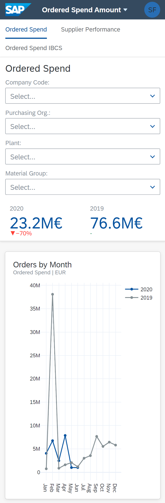
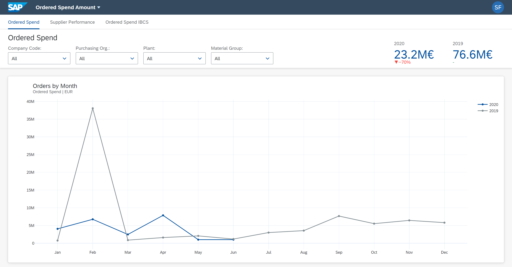

# Dashboard
The goal of this project is to create a dashboard to give a fictitious company a clear overview of its deliveries in terms of volume and quality. The web app is built upon libraries such as NumPy, Pandas and Dash. The Plotly library is used to display the charts contained in the dashboard.
## Installation
Before running the application make sure you have **Python 3.9** installed.

To install the requirements:
```
pip install -r requirements.txt
```
To start the application:
```
python src/index.py
```

## Requirements
View [requirements](requirements.txt).

## Design Guidelines
View [SAP Fiori Guidelines](https://experience.sap.com/fiori-design-web/).

## App

### Mobile View


### Desktop View


## License

This repository is released under the [MIT license](https://opensource.org/licenses/MIT). In short, this means you are free to use this software in any personal, open-source or commercial projects. Attribution is optional but appreciated.
