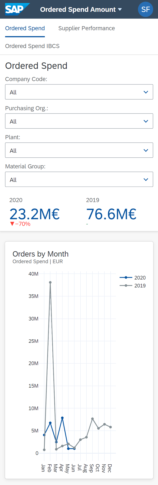

# Dashboard
The goal of this project is to create a dashboard to give a fictitious company a clear overview of its deliveries in terms of volume and quality.

## Installation
Before running the application make sure you have **Python 3.9** installed.

To install the requirements:
```
pip install -r requirements.txt
```
To start the application:
```
python src/index.py
```

## Requirements
View [requirements](requirements.txt).

## Responsive

### Mobile


### Desktop


## License

This repository is released under the [MIT license](https://opensource.org/licenses/MIT). In short, this means you are free to use this software in any personal, open-source or commercial projects. Attribution is optional but appreciated.

## LaTex Link
https://www.overleaf.com/4481197887tkfymkpbsjyk
